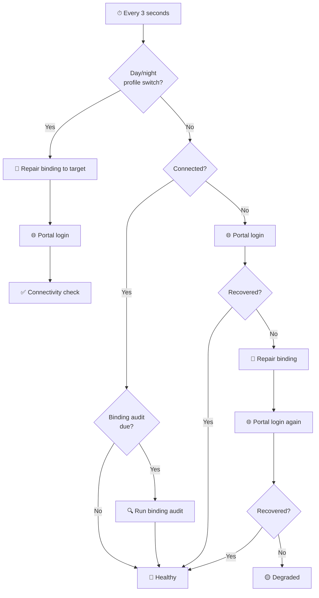
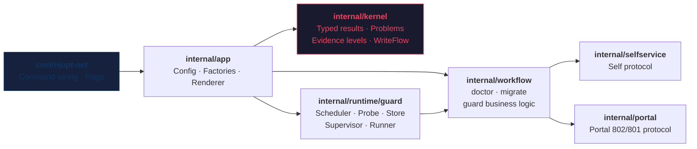

<div align="center">

# njupt-net

**NJUPT Campus Network Terminal System** — Login · Diagnose · Guard · Deploy to Router

[](https://github.com/hicancan/njupt-net/actions/workflows/release.yml)
[](go.mod)
[](https://github.com/hicancan/njupt-net/releases)
[](LICENSE)
[](https://github.com/hicancan/njupt-net/stargazers)

[中文](README.md) | English

One Go binary for everything painful about NJUPT campus networking:<br>
login, diagnosis, broadband binding, consume protection, and 24/7 guarding.<br>
Runs on desktop & OpenWrt/ImmortalWrt routers. `--output json` for automation.

[**Quick Start**](#-quick-start) · [**Features**](#-features) · [**Router Deployment**](#-router-deployment) · [**Architecture**](#%EF%B8%8F-architecture)

</div>

---

## ✨ Key Features

<table>
<tr>
<td width="50%">

### 🔐 Dual-System Authentication
One command for the full Self auth chain or Portal 802 JSONP login.<br>Handles checkcode, randomCode, and redirect verification automatically.

### 📊 Full-Spectrum Queries
Online devices · Login history · Billing · MAC list · Broadband binding · Consume protection · Person info

### ✍️ Safe Write Operations
All mutations are `readback-first` by default: pre-state → submit → readback → compare → optional restore.

</td>
<td width="50%">

### 🛡️ 24/7 Guard Engine
Built-in day/night scheduling, binding audit, connectivity probing, and Portal recovery chain. Supports foreground, background daemon, and procd service modes.

### 🌐 One-Click Router Deployment
`install-immortalwrt.ps1` auto-builds, uploads, and installs a procd service.<br>State files go to `/tmp` — zero flash wear.

### 🤖 Machine-Readable API
`--output json` is a first-class contract: typed `OperationResult`,<br>`problems[].code`, guard status/events — all automatable.

</td>
</tr>
</table>

## ⚡ Quick Start

```bash
# 1. Download from Releases, or build locally
go build -o njupt-net ./cmd/njupt-net

# 2. Create your config (see template below)
cp config.example.json config.json && vim config.json

# 3. Login
njupt-net self login --profile B

# 4. Diagnose
njupt-net self doctor --profile B

# 5. Start the 24/7 guard
njupt-net guard start --replace --yes
```

## 📦 Installation

### Prebuilt Binaries (Recommended)

Go to [**Releases**](https://github.com/hicancan/njupt-net/releases) and download for your platform:

| Platform | Filename |
|---|---|
| Windows x64 | `njupt-net-windows-amd64.exe` |
| Linux x64 | `njupt-net-linux-amd64` |
| Linux ARM64 (router) | `njupt-net-linux-arm64` |
| macOS ARM64 | `njupt-net-darwin-arm64` |

### Build from Source

```bash
# Requires Go 1.26+
git clone https://github.com/hicancan/njupt-net.git
cd njupt-net

# Current platform
go build -o njupt-net ./cmd/njupt-net

# Cross-platform
bash ./scripts/build.sh all        # Linux/macOS
.\scripts\build.ps1 -Mode all      # Windows PowerShell
```

## 🔧 Configuration

Create `config.json` (recommended: copy from `config.example.json`; already in `.gitignore` and never committed):

```jsonc
{
  "accounts": {
    "B": { "username": "your-student-id", "password": "your-password" },
    "W": { "username": "your-student-id", "password": "your-password" }
  },
  "cmcc": {
    "account": "your-mobile-broadband-number",
    "password": "your-mobile-broadband-password"
  },
  "portal": {
    "baseURL": "https://10.10.244.11:802/eportal/portal",
    "isp": "mobile",
    "insecureTLS": true
  },
  "guard": {
    "schedule": {
      "dayProfile": "B",
      "nightProfile": "W",
      "nightStart": "23:30",
      "nightEnd": "07:00"
    }
  }
}
```

`guard.schedule.dayProfile` and `guard.schedule.nightProfile` are now **required**. `B` / `W` are example profile names only; there are no implicit guard defaults anymore.

<details>
<summary>📄 Full Configuration Reference</summary>

| Key | Default | Description |
|---|---|---|
| `self.baseURL` | `http://10.10.244.240:8080` | Self service endpoint |
| `self.timeoutSeconds` | `10` | Self request timeout |
| `portal.baseURL` | `https://10.10.244.11:802/eportal/portal` | Portal service endpoint |
| `portal.fallbackBaseURLs` | `[]` | Portal fallback endpoints |
| `portal.isp` | `mobile` | ISP type: `telecom` / `unicom` / `mobile` |
| `portal.timeoutSeconds` | `8` | Portal request timeout |
| `portal.insecureTLS` | `false` | Skip TLS certificate verification |
| `guard.stateDir` | `dist/guard` | Guard state directory |
| `guard.probeIntervalSeconds` | `3` | Connectivity probe interval |
| `guard.bindingCheckIntervalSeconds` | `180` | Binding audit interval |
| `guard.timezone` | `Asia/Shanghai` | Schedule timezone |
| `guard.schedule.dayProfile` | no default | Profile name used during the day; required |
| `guard.schedule.nightProfile` | no default | Profile name used at night; required |
| `guard.schedule.nightStart` | `23:30` | Night window start time |
| `guard.schedule.nightEnd` | `07:00` | Night window end time |
| `output` | `human` | Default output mode: `human` / `json` |

Override via environment variables: `NJUPT_NET_CONFIG`, `NJUPT_NET_OUTPUT`, `NJUPT_NET_SELF_BASE_URL`, `NJUPT_NET_PORTAL_BASE_URL`, etc.

</details>

## 📖 Features

### Command Reference

Top-level commands: `self` `dashboard` `service` `setting` `bill` `portal` `raw` `guard`

```
njupt-net
├── self            # Self authentication & diagnosis
│   ├── login           authenticate
│   ├── logout          end session
│   ├── status          check session state
│   └── doctor          full health check
├── dashboard       # Dashboard operations
│   ├── online-list     current online devices
│   ├── login-history   login history records
│   ├── refresh-account-raw  refresh raw account payload
│   ├── offline         force-offline a session
│   └── mauth
│       ├── get         read mauth state
│       └── toggle      toggle mauth state
├── service         # Service management
│   ├── binding
│   │   ├── get         read broadband binding
│   │   └── set         change broadband binding
│   ├── consume
│   │   ├── get         read consume protection
│   │   └── set         change consume protection
│   ├── mac
│   │   └── list        MAC address list
│   └── migrate         cross-account broadband migration
├── setting         # Personal settings
│   └── person
│       ├── get         read person info
│       └── update      update person info
├── bill            # Billing queries
│   ├── online-log      usage logs
│   ├── month-pay       monthly billing
│   └── operator-log    operator logs
├── portal          # Portal protocol
│   ├── login           802 login
│   ├── logout          802 logout
│   ├── login-801       801 admin probe
│   └── logout-801      801 logout probe
├── raw             # Low-level debugging
│   ├── get             raw GET request
│   └── post            raw POST request
└── guard           # Guard engine
    ├── run             foreground execution
    ├── start           background daemon
    ├── stop            stop guard
    ├── status          view status
    └── once            single cycle (debug)
```

### Usage Examples

```bash
# Login and check status
njupt-net self login --profile B
njupt-net self status --profile B

# View online devices
njupt-net dashboard online-list --profile B

# Check broadband binding
njupt-net service binding get --profile B

# Update consume protection limit (requires --yes)
njupt-net service consume set --profile B --limit 50 --yes

# Portal login (requires --ip)
njupt-net portal login --profile B --ip 10.163.177.138

# Start guard (replace existing instance)
njupt-net guard start --replace --yes

# JSON output (for scripting)
njupt-net guard status --output json
njupt-net self doctor --profile B --output json
```

## 🛡️ Guard Engine

The guard is a real runtime, not a `while true; sleep 3` script.

### Recovery Flow



### Execution Modes

| Mode | Command | Best For |
|---|---|---|
| **Foreground** | `guard run --yes` | Debugging, log inspection |
| **Background** | `guard start --yes` | Desktop long-running |
| **procd service** | `install-immortalwrt.ps1` | Router deployment |

### Default Policy

- ☀️ Day 07:00–23:30 → profile `B`
- 🌙 Night 23:30–07:00 → profile `W`
- **Immediate** recovery when connectivity fails
- Binding correctness audit every 180 seconds
- Graceful SIGTERM on stop, forced kill on timeout

## 🌐 Router Deployment

Deploy to OpenWrt/ImmortalWrt in one command:

```powershell
# Build + upload + install + start
.\scripts\install-immortalwrt.ps1 -Build

# Update binary only (keep config)
.\scripts\install-immortalwrt.ps1 -SkipConfigUpload

# Custom hostname
.\scripts\install-immortalwrt.ps1 -HostName myrouter -Build
```

**Requirements**: local `ssh`/`scp`, router must be `aarch64`/`arm64`.

<details>
<summary>📋 Router-Side Commands</summary>

```bash
# Service management
/etc/init.d/njupt-net status
/etc/init.d/njupt-net restart
/etc/init.d/njupt-net stop

# Guard status
njupt-net --config /etc/njupt-net/config.json --output json guard status

# Logs
logread -e njupt-net
cat /tmp/njupt-net/status.json
```

</details>

## 🏗️ Architecture

A **disciplined modular monolith**. No multi-repo, no plugin framework.



### Design Principles

| Layer | Responsibility | Does NOT |
|---|---|---|
| `cmd/` | Command wiring, flag binding | Contain business logic |
| `internal/app` | Config loading, client factories | Call HTTP directly |
| `internal/kernel` | Typed results, problem model, evidence levels | Depend on any protocol package |
| `internal/selfservice` | Self protocol requests & parsing | Construct workflows |
| `internal/portal` | Portal JSONP/JSON parsing | Depend on Self |
| `internal/workflow` | Use-case composition | Construct transport |
| `internal/runtime/guard` | Scheduling, probing, state persistence | Contain protocol details |

## 📐 Evidence Model

Reverse-engineered certainty is **part of the runtime API**, not just documentation.

| Level | Meaning | Examples |
|---|---|---|
| `confirmed` | Verified and supported | Self login, broadband binding, Portal 802 |
| `guarded` | Available but conservative | Portal `AC999` already-online |
| `blocked` | Endpoint exists but semantics insufficient | `setting person update`, `portal login-801` |

## 🔌 JSON API

`--output json` is a supported long-term interface.

```bash
njupt-net self doctor --profile B --output json | jq '.success'
njupt-net guard status --output json | jq '.data.health'
```

<details>
<summary>📋 OperationResult Structure</summary>

```jsonc
{
  "level": "confirmed",     // Evidence level
  "success": true,          // Whether operation succeeded
  "message": "...",         // Human-readable (not part of contract)
  "data": { ... },          // Typed business data
  "problems": [             // Problem list
    {
      "code": "auth_failed",
      "message": "...",
      "details": { ... }
    }
  ],
  "raw": { ... }            // Raw diagnostic data
}
```

</details>

## ✅ Quality Gates

```bash
go test ./...          # Run all tests
go vet ./...           # Static analysis
gofmt -l .             # Format check
```

CI pipeline: `gofmt` → `go test -cover` → `go vet` → `staticcheck` → cross-platform builds.

## 📂 Project Layout

```
njupt-net/
├── cmd/njupt-net/          # CLI entry point & command wiring
├── internal/
│   ├── app/                # Application context & factories
│   ├── config/             # Config loading & validation
│   ├── httpx/              # HTTP session client
│   ├── kernel/             # Core types & error model
│   ├── output/             # Output renderer (human/json)
│   ├── portal/             # Portal protocol implementation
│   ├── selfservice/        # Self protocol implementation
│   ├── runtime/guard/      # Guard runtime
│   └── workflow/           # Business workflows
├── scripts/                # Build & deployment scripts
├── doc/                    # Design documents
├── .github/workflows/      # CI/CD
├── go.mod
└── LICENSE
```

## 📄 License

[MIT](LICENSE) © hicancan
