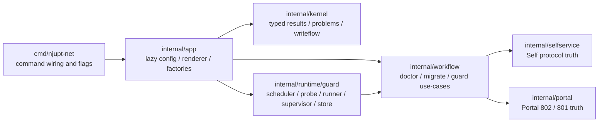
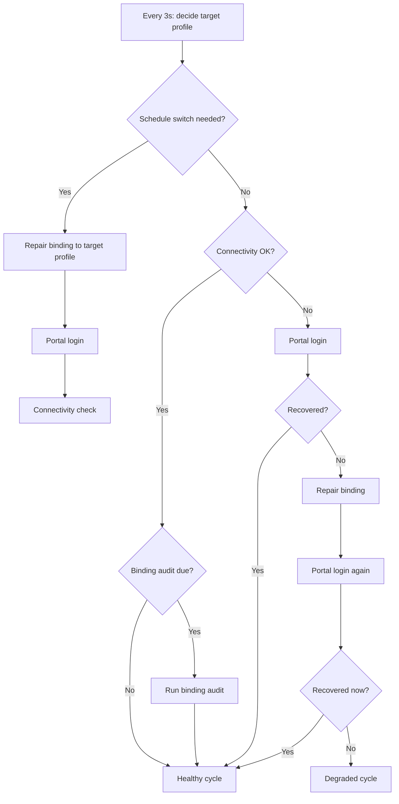

# njupt-net

[中文](README.md) | English

[](https://github.com/hicancan/njupt-net/actions/workflows/release.yml)
[](https://github.com/hicancan/njupt-net/blob/main/go.mod)
[](https://github.com/hicancan/njupt-net/releases)
[](https://github.com/hicancan/njupt-net/blob/main/LICENSE)
[](https://github.com/hicancan/njupt-net/stargazers)

> One Go binary for the messy parts of NJUPT campus networking: login, diagnosis, repair, automation, and always-on guarding.

`njupt-net` is a Go terminal system for the NJUPT networking environment.  
It is not just a thin wrapper over existing web pages. It is a typed kernel, a workflow layer, and a real guard runtime packaged into one repository and one binary.

Use it when you want to:

- log in to Self and Portal reliably from a terminal
- query online state, billing, MAC addresses, broadband binding, and login history
- perform controlled writes such as binding changes, consume-protect updates, and mauth toggles with readback verification
- keep a long-running day/night guard on a desktop or a router
- integrate campus networking behavior into your own scripts with stable `--output json`

## Why This Exists

Campus networking problems are rarely about “clicking the login button.”  
They are about everything around it:

- Self and Portal are different systems with different semantics
- some reverse-engineered paths exist, but their success criteria are not equally trustworthy
- writes are dangerous if you cannot verify them after submission
- daemon logic becomes fragile quickly when it is only a pile of scripts
- router deployment gets messy if desktop and OpenWrt paths drift apart

`njupt-net` exists to turn that mess into a system that is explicit, typed, testable, and automatable.

## Highlights

- **A typed kernel, not a throwaway CLI wrapper**
  - protocol truth, evidence levels, error families, and write semantics live in Go types rather than command-layer heuristics
- **Reverse-engineered certainty is explicit**
  - `confirmed / guarded / blocked` are runtime semantics, not just notes in documentation
- **Writes are readback-first by default**
  - broadband binding, consume-protect, and mauth updates all follow the same verified write pipeline
- **The guard is a real runtime**
  - desktop and router deployments share one scheduler, one recovery model, one status model, and one event model
- **JSON output is treated as a supported interface**
  - `OperationResult`, `problems[].code + details`, `guard status`, and `guard events` are designed for automation, not just debugging

## Common Use Cases

| Use case | Commands you will likely use |
| --- | --- |
| reliable login and diagnosis | `self login` `self status` `self doctor` |
| online-session and history inspection | `dashboard online-list` `dashboard login-history` |
| broadband binding, consume-protect, and MAC work | `service binding` `service consume` `service mac` |
| billing and usage records | `bill month-pay` `bill online-log` `bill operator-log` |
| low-level Self/Portal debugging | `portal login` `portal logout` `raw get` `raw post` |
| long-running day/night guard | `guard start` `guard status` `guard once` |

## Architecture At A Glance

The project is intentionally a disciplined modular monolith.  
No multi-repo split, no plugin framework, no extra abstraction layer on top of Cobra.



### Design Rules

- `cmd/njupt-net`
  - command wiring and flag parsing only
- `internal/app`
  - lazy config loading, output selection, client/session factories, confirmation policy
- `internal/kernel`
  - evidence levels, `OperationResult`, typed problems, transport contract, writeflow semantics
- `internal/selfservice`
  - Self requests, parsing, and typed model mapping
- `internal/portal`
  - Portal request building, JSONP parsing, `ret_code` classification, and typed mapping
- `internal/workflow`
  - pure use-cases, no concrete transport construction
- `internal/runtime/guard`
  - daemon state machine, scheduling, probing, status files, events, and background execution

## Guard Recovery Flow

The guard is designed to be observable and aggressive, not silent and mysterious.



Default guard behavior:

- day profile: `B`
- night profile: `W`
- no proactive `logout`
- immediate recovery when connectivity fails
- graceful stop request before forced kill

## Command Surface

`njupt-net` currently exposes **8 domain groups and 32 leaf commands**.

### Top-Level Groups

- `self`
- `dashboard`
- `service`
- `setting`
- `bill`
- `portal`
- `raw`
- `guard`

### Domain Map

| Domain | Typical commands | Purpose |
| --- | --- | --- |
| `self` | `login`, `logout`, `status`, `doctor` | authoritative Self login and diagnosis |
| `dashboard` | `online-list`, `login-history`, `mauth`, `offline` | operational state and offline control |
| `service` | `binding`, `consume`, `mac`, `migrate` | broadband state and controlled writes |
| `setting` | `person get`, `person update` | sanitized person-state reads and blocked update semantics |
| `bill` | `month-pay`, `online-log`, `operator-log` | billing and usage records |
| `portal` | `login`, `logout`, `login-801`, `logout-801` | Portal 802 primary flow and 801 admin probe |
| `raw` | `get`, `post` | low-level debugging probes |
| `guard` | `run`, `start`, `stop`, `status`, `once` | long-running guard runtime |

<details>
<summary>Full command tree</summary>

```text
njupt-net
  self
    login
    logout
    status
    doctor
  dashboard
    online-list
    login-history
    refresh-account-raw
    offline
    mauth get
    mauth toggle
  service
    binding get
    binding set
    consume get
    consume set
    mac list
    migrate
  setting
    person get
    person update
  bill
    month-pay
    online-log
    operator-log
  portal
    login
    logout
    login-801
    logout-801
  raw
    get
    post
  guard
    run
    start
    stop
    status
    once
```

</details>

## Quick Start

### 1. Get a binary

You can:

- download a prebuilt artifact from [Releases](https://github.com/hicancan/njupt-net/releases)
- or build locally

```bash
go build ./...
```

Cross-platform builds:

```bash
bash ./scripts/build.sh all
```

```powershell
.\scripts\build.ps1 -Mode all
```

### 2. Create `config.json`

Minimal example:

```json
{
  "accounts": {
    "B": {
      "username": "your-student-id",
      "password": "your-password"
    },
    "W": {
      "username": "your-student-id",
      "password": "your-password"
    }
  },
  "cmcc": {
    "account": "your-mobile-broadband-account",
    "password": "your-mobile-broadband-password"
  },
  "self": {
    "baseURL": "http://10.10.244.240:8080",
    "timeoutSeconds": 10
  },
  "portal": {
    "baseURL": "https://10.10.244.11:802/eportal/portal",
    "isp": "mobile",
    "timeoutSeconds": 8,
    "insecureTLS": true
  },
  "guard": {
    "stateDir": "dist/guard",
    "probeIntervalSeconds": 3,
    "bindingCheckIntervalSeconds": 180,
    "timezone": "Asia/Shanghai",
    "schedule": {
      "dayProfile": "B",
      "nightProfile": "W",
      "nightStart": "23:30",
      "nightEnd": "07:00"
    }
  }
}
```

If you need an additional 802 fallback, configure `portal.fallbackBaseURLs` explicitly. Router deployments now default to the direct IP endpoint and no longer inject a domain fallback implicitly.

### 3. Common commands

```bash
njupt-net self login --profile B
njupt-net self status --profile B
njupt-net service binding get --profile B
njupt-net portal login --profile B --ip 10.163.177.138
njupt-net guard start --replace
njupt-net guard status --output json
```

### 4. Local validation

```powershell
.\scripts\test-local.ps1
```

Read-only smoke:

```powershell
.\scripts\test-local.ps1 -ReadOnly -SkipPortal
```

## Router / ImmortalWrt Deployment

If you want to run the guard on a router, `scripts/install-immortalwrt.ps1` is now an officially supported deployment path.

Deployment model:

- local PowerShell script handles upload and install
- router side uses `procd + guard run`
- runtime state defaults to `/tmp` to avoid flash write churn

Minimum requirements:

- local `ssh` and `scp`
- router architecture `aarch64` / `arm64`
- direct SSH access such as `root@immortalwrt`, or an override via `-HostName`

Common commands:

```powershell
.\scripts\install-immortalwrt.ps1
.\scripts\install-immortalwrt.ps1 -Build
.\scripts\install-immortalwrt.ps1 -SkipConfigUpload
```

Useful commands on the router after deployment:

```sh
/etc/init.d/njupt-net status
/etc/init.d/njupt-net restart
/etc/init.d/njupt-net stop
/usr/bin/njupt-net --config /etc/njupt-net/config.json --output json guard status --state-dir /tmp/njupt-net
logread -e njupt-net
cat /tmp/njupt-net/status.json
```

## Machine-Readable Contract

`--output json` is a supported long-term interface, not a debug convenience.

### Stable contract surface

- top-level `OperationResult`
- `problems[].code`
- `problems[].details`
- nested `guard status`
- `guard event.kind + details`

### Not part of the compatibility promise

- `message`
- terminal-oriented human output
- explanatory prose in the README
- raw HTML from standard `setting person` results; sensitive page payloads are only exposed through controlled raw/debug paths

### Operation envelope

Every command returns a typed `OperationResult`:

- `level`
- `success`
- `message`
- `data`
- `problems`
- `raw`

### Problems

Each problem exposes:

- `code`
- `message`
- `details`

Major typed families include:

- portal problems
- readback / restore / state-comparison problems
- invalid-config problems
- guarded / blocked capability problems

### Guard status

`guard status --output json` uses this stable nested structure:

- `running`
- `health`
- `desiredProfile`
- `scheduleWindow`
- `binding`
- `connectivity`
- `portal`
- `cycle`
- `timing`
- `log`

### Guard events

Guard runtime events are JSONL records with stable `kind` values:

- `startup`
- `schedule-switch`
- `binding-audit`
- `portal-login`
- `binding-repair`
- `degraded`
- `shutdown`
- `fatal`

## Evidence Model

Reverse-engineered certainty is part of the runtime API.

| Level | Meaning | Examples |
| --- | --- | --- |
| `confirmed` | safe to ship as a supported capability | Self login chain, broadband binding write, Portal 802 |
| `guarded` | exposed, but intentionally conservative | transitional states such as Portal 802 `AC999` already-online responses |
| `blocked` | known endpoint exists, but semantics are not strong enough to promise as supported truth | `setting person update`, `portal login-801` admin-login probe |

## Quality Gates

Local gates:

```bash
go test ./...
go test -cover ./...
go vet ./...
```

```powershell
.\scripts\build.ps1 -Mode all
.\scripts\test-local.ps1 -ReadOnly -SkipPortal
```

GitHub Actions continuously enforces:

- `gofmt`
- `go test`
- `go test -cover`
- `go vet`
- `staticcheck`
- cross-platform builds
- PowerShell parsing for `install-immortalwrt.ps1`

## Project Layout

```text
.
├── cmd/njupt-net
├── doc
├── internal/app
├── internal/kernel
├── internal/portal
├── internal/runtime/guard
├── internal/selfservice
├── internal/workflow
└── scripts
```

## Documentation

Source-of-truth and architecture references:

- [doc/FINAL-SSOT.md](doc/FINAL-SSOT.md)
- [doc/IMPLEMENTATION-TASK.md](doc/IMPLEMENTATION-TASK.md)
- [doc/ARCHITECTURE-REVIEW.md](doc/ARCHITECTURE-REVIEW.md)
- [doc/CAPABILITY-MATRIX.md](doc/CAPABILITY-MATRIX.md)

## Notes

- the supported product name is `njupt-net`
- the current mainline is the Go CLI, typed kernel, and Go guard runtime
- historical Python / PowerShell guard helpers are no longer the supported runtime path
