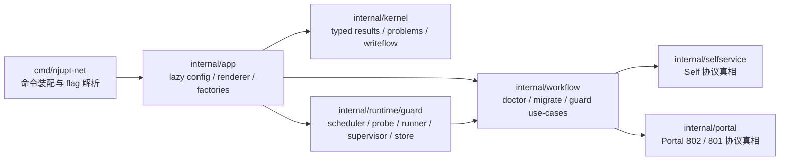
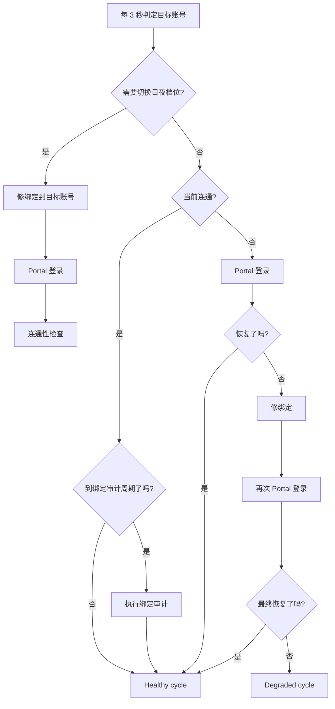

# njupt-net

中文 | [English](README.en.md)

[](https://github.com/hicancan/njupt-net/actions/workflows/release.yml)
[](https://github.com/hicancan/njupt-net/blob/main/go.mod)
[](https://github.com/hicancan/njupt-net/releases)
[](https://github.com/hicancan/njupt-net/blob/main/LICENSE)
[](https://github.com/hicancan/njupt-net/stargazers)

> 把 NJUPT 校园网里最麻烦的事情，收进一个可脚本化、可守护、可部署到路由器的 Go 二进制。

`njupt-net` 是一个面向 NJUPT 校园网环境的 Go 终端系统。  
它不是一个只会“点一下登录”的薄封装 CLI，而是一套完整的 typed kernel + workflow + guard runtime。

你可以用它做这些事：

- 在终端里稳定登录 Self 和 Portal
- 查询在线状态、登录历史、账单、MAC 与宽带绑定信息
- 安全地修改宽带绑定、消费保护、mauth，并且默认带 readback 验证
- 在桌面或路由器上长期守护，白天守 `B`，夜间守 `W`
- 用 `--output json` 接入脚本、自动化、监控或你自己的工具链

## 为什么会有这个项目

校园网最烦的从来不是“不会点网页登录”，而是这些边角问题：

- Self 和 Portal 是两套不同语义的系统
- 一些能力能做，但成功语义并不总是稳定
- 写操作如果没有 readback，很难知道到底有没有真正生效
- 守护一旦只是脚本拼装，状态、日志、恢复链就会越来越混乱
- 路由器部署如果没有统一 runtime，桌面和 OpenWrt 会变成两套世界

`njupt-net` 的目标，就是把这些问题变成一套清晰、可测试、可维护、可自动化的终端系统。

## 项目亮点

- **不是“网页登录脚本”，而是 typed kernel**
  - 协议真相、错误模型、证据级别、写操作语义都在 Go 类型里，而不是散落在命令层字符串判断里。
- **逆向确定性会体现在运行时**
  - `confirmed / guarded / blocked` 不是文档注释，而是结果模型和命令行为的一部分。
- **写操作默认 readback-first**
  - 宽带绑定、消费保护、mauth 等修改统一走 `pre-state -> submit -> readback -> compare -> optional restore`。
- **守护是正式 runtime，不是脚本循环**
  - 桌面和路由器共用同一套调度、恢复链、状态文件、事件日志和 PID 管理。
- **JSON 输出是长期支持接口**
  - `OperationResult`、`problems[].code + details`、`guard status`、`guard events` 都是正式契约，不是调试副产物。

## 你大概会怎么用它

| 场景 | 最常用的命令 |
| --- | --- |
| 登录与诊断 | `self login` `self status` `self doctor` |
| 查看在线设备和历史记录 | `dashboard online-list` `dashboard login-history` |
| 管理宽带绑定、消费保护、MAC | `service binding` `service consume` `service mac` |
| 查询账单与在线日志 | `bill month-pay` `bill online-log` `bill operator-log` |
| 排查 Portal / Self 的低层问题 | `portal login` `portal logout` `raw get` `raw post` |
| 在桌面或路由器上长期守护 | `guard start` `guard status` `guard once` |

## 架构一眼看懂

项目采用克制的模块化单体架构。  
不拆多仓，不引入插件系统，也不把 Cobra 再包成一层自己的框架。



### 设计原则

- `cmd/njupt-net`
  - 只负责命令装配和参数解析
- `internal/app`
  - 负责 lazy config、输出模式、client factory、确认策略
- `internal/kernel`
  - 负责 evidence level、`OperationResult`、typed problem、writeflow 语义
- `internal/selfservice`
  - 负责 Self 的请求、解析、模型映射
- `internal/portal`
  - 负责 Portal 请求构建、JSONP 解析、`ret_code` 分类、模型映射
- `internal/workflow`
  - 只负责 use-case 组合，不直接构造 transport
- `internal/runtime/guard`
  - 负责守护状态机、调度、探测、状态文件、事件日志和后台运行

## 守护恢复链

`guard` 的目标不是“安静挂着”，而是“快速发现、快速恢复、状态可观测”。



默认守护策略：

- 白天守 `B`
- 夜间守 `W`
- 不主动 `logout`
- 连通性失败后立即恢复
- `stop` 先优雅退出，再超时强停

## 功能清单

当前 CLI 共有 **8 个功能域，32 个叶子命令**。

### 顶层功能域

- `self`
- `dashboard`
- `service`
- `setting`
- `bill`
- `portal`
- `raw`
- `guard`

### 功能域说明

| 功能域 | 典型命令 | 作用 |
| --- | --- | --- |
| `self` | `login`, `logout`, `status`, `doctor` | Self 登录与诊断主路径 |
| `dashboard` | `online-list`, `login-history`, `mauth`, `offline` | 在线会话、历史记录、guarded 操作 |
| `service` | `binding`, `consume`, `mac`, `migrate` | 宽带绑定、消费保护、MAC、迁移工作流 |
| `setting` | `person get`, `person update` | 个人资料相关 guarded / blocked 面 |
| `bill` | `month-pay`, `online-log`, `operator-log` | 账单与记录查询 |
| `portal` | `login`, `logout`, `login-801`, `logout-801` | Portal 802 主链与 801 fallback |
| `raw` | `get`, `post` | 低层调试探针 |
| `guard` | `run`, `start`, `stop`, `status`, `once` | Go 守护运行时 |

<details>
<summary>完整命令树</summary>

```text
njupt-net
  self
    login
    logout
    status
    doctor
  dashboard
    online-list
    login-history
    refresh-account-raw
    offline
    mauth get
    mauth toggle
  service
    binding get
    binding set
    consume get
    consume set
    mac list
    migrate
  setting
    person get
    person update
  bill
    month-pay
    online-log
    operator-log
  portal
    login
    logout
    login-801
    logout-801
  raw
    get
    post
  guard
    run
    start
    stop
    status
    once
```

</details>

## 快速开始

### 1. 获取二进制

你可以：

- 从 [Releases](https://github.com/hicancan/njupt-net/releases) 下载预编译二进制
- 或者本地直接编译

```bash
go build ./...
```

跨平台构建：

```bash
bash ./scripts/build.sh all
```

```powershell
.\scripts\build.ps1 -Mode all
```

### 2. 准备 `credentials.json`

最小示例：

```json
{
  "accounts": {
    "B": {
      "username": "你的学号",
      "password": "你的密码"
    },
    "W": {
      "username": "你的学号",
      "password": "你的密码"
    }
  },
  "cmcc": {
    "account": "你的移动宽带账号",
    "password": "你的移动宽带密码"
  },
  "self": {
    "baseURL": "http://10.10.244.240:8080",
    "timeoutSeconds": 10
  },
  "portal": {
    "baseURL": "https://10.10.244.11:802/eportal/portal",
    "fallbackBaseURLs": [
      "https://p.njupt.edu.cn:802/eportal/portal"
    ],
    "isp": "mobile",
    "timeoutSeconds": 8,
    "insecureTLS": true
  },
  "guard": {
    "stateDir": "dist/guard",
    "probeIntervalSeconds": 3,
    "bindingCheckIntervalSeconds": 180,
    "timezone": "Asia/Shanghai",
    "schedule": {
      "dayProfile": "B",
      "nightProfile": "W",
      "nightStart": "23:30",
      "nightEnd": "07:00"
    }
  }
}
```

### 3. 常用命令

```bash
njupt-net self login --profile B
njupt-net self status --profile B
njupt-net service binding get --profile B
njupt-net portal login --profile B --ip 10.163.177.138
njupt-net guard start --replace
njupt-net guard status --output json
```

### 4. 本地验证

```powershell
.\scripts\test-local.ps1
```

只读 smoke：

```powershell
.\scripts\test-local.ps1 -ReadOnly -SkipPortal
```

## Router / ImmortalWrt 部署

如果你想把守护跑在路由器上，`scripts/install-immortalwrt.ps1` 已经是正式支持路径。

部署模型：

- 本机 PowerShell 脚本负责上传与安装
- 路由器侧使用 `procd + guard run`
- 状态目录默认走 `/tmp`，避免高频写闪存

最低要求：

- 本机可用 `ssh` 与 `scp`
- 路由器架构为 `aarch64` / `arm64`
- 路由器能以 `root@immortalwrt` 直接 SSH 连接，或通过 `-HostName` 指定

常用命令：

```powershell
.\scripts\install-immortalwrt.ps1
.\scripts\install-immortalwrt.ps1 -Build
.\scripts\install-immortalwrt.ps1 -SkipConfigUpload
```

部署后，路由器上常用命令：

```sh
/etc/init.d/njupt-net status
/etc/init.d/njupt-net restart
/etc/init.d/njupt-net stop
/usr/bin/njupt-net --config /etc/njupt-net/credentials.json --output json guard status --state-dir /tmp/njupt-net-guard
logread -e njupt-net
cat /tmp/njupt-net-guard/status.json
```

## 机器可读契约

`--output json` 是正式支持的长期接口，不是调试附属品。

### 稳定契约

- 顶层 `OperationResult`
- `problems[].code`
- `problems[].details`
- `guard status` 的嵌套字段结构
- `guard event.kind + details`

### 不属于机器兼容承诺的部分

- `message`
- 人类可读终端文本
- README 中的解释性示例

### 顶层结果结构

所有命令都返回 typed `OperationResult`：

- `level`
- `success`
- `message`
- `data`
- `problems`
- `raw`

### Problems

问题对象由这三部分构成：

- `code`
- `message`
- `details`

当前重点的 typed family 包括：

- Portal 问题
- readback / restore / state-comparison 问题
- invalid-config 问题
- guarded / blocked capability 问题

### Guard Status

`guard status --output json` 使用稳定嵌套结构：

- `running`
- `health`
- `desiredProfile`
- `scheduleWindow`
- `binding`
- `connectivity`
- `portal`
- `cycle`
- `timing`
- `log`

### Guard Events

守护事件采用 JSONL 输出，稳定的 `kind` 包括：

- `startup`
- `schedule-switch`
- `binding-audit`
- `portal-login`
- `binding-repair`
- `degraded`
- `shutdown`
- `fatal`

## 证据级别模型

逆向确定性模型是运行时 API 的一部分。

| 级别 | 含义 | 例子 |
| --- | --- | --- |
| `confirmed` | 已确认，可作为正式能力实现 | Self 登录主链、宽带绑定写入、Portal 802 |
| `guarded` | 可暴露，但必须保守处理 | force offline、Portal 801 fallback |
| `blocked` | 已知接口存在，但成功语义不足以正式承诺 | 某些环境敏感的用户资料更新路径 |

## 质量保证

本地门禁：

```bash
go test ./...
go test -cover ./...
go vet ./...
```

```powershell
.\scripts\build.ps1 -Mode all
.\scripts\test-local.ps1 -ReadOnly -SkipPortal
```

GitHub Actions 持续强制：

- `gofmt`
- `go test`
- `go test -cover`
- `go vet`
- `staticcheck`
- 多平台构建
- `install-immortalwrt.ps1` PowerShell 语法解析检查

## 项目结构

```text
.
├── cmd/njupt-net
├── doc
├── internal/app
├── internal/kernel
├── internal/portal
├── internal/runtime/guard
├── internal/selfservice
├── internal/workflow
└── scripts
```

## 相关文档

- [doc/FINAL-SSOT.md](doc/FINAL-SSOT.md)
- [doc/IMPLEMENTATION-TASK.md](doc/IMPLEMENTATION-TASK.md)
- [doc/ARCHITECTURE-REVIEW.md](doc/ARCHITECTURE-REVIEW.md)
- [doc/CAPABILITY-MATRIX.md](doc/CAPABILITY-MATRIX.md)

## 说明

- 正式产品名是 `njupt-net`
- 当前主线是 Go CLI、typed kernel、Go guard runtime
- 历史 Python / PowerShell 守护脚本不再是正式支持路径
