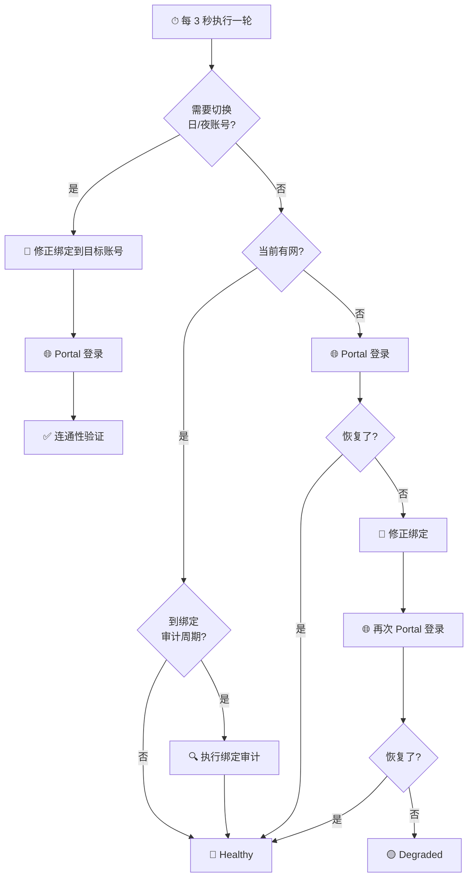
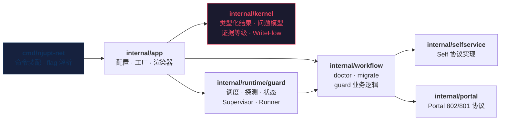

<div align="center">

# njupt-net

**NJUPT 校园网终端系统** — 登录 · 诊断 · 守护 · 一键部署路由器

[](https://github.com/hicancan/njupt-net/actions/workflows/release.yml)
[](go.mod)
[](https://github.com/hicancan/njupt-net/releases)
[](LICENSE)
[](https://github.com/hicancan/njupt-net/stargazers)

中文 | [English](README.en.md)

一个 Go 二进制，解决 NJUPT 校园网登录、诊断、宽带绑定、消费保护、24 小时守护等全部痛点。<br>
支持桌面 & OpenWrt/ImmortalWrt 路由器，`--output json` 原生支持自动化集成。

[**快速开始**](#-快速开始) · [**功能总览**](#-功能总览) · [**路由器部署**](#-路由器部署) · [**架构设计**](#-架构设计)

</div>

---

## ✨ 核心特性

<table>
<tr>
<td width="50%">

### 🔐 Self & Portal 双系统登录
一条命令完成 Self 认证链或 Portal 802 JSONP 登录，<br>自动处理 checkcode、randomCode、重定向验证。

### 📊 全维度查询
在线设备 · 登录历史 · 账单明细 · MAC 列表 · 宽带绑定 · 消费保护 · 个人信息

### ✍️ 安全写操作
所有修改默认 `readback-first`：拉取前置状态 → 提交 → 读回验证 → 可选回滚。

</td>
<td width="50%">

### 🛡️ 7×24 守护引擎
内置日夜调度、绑定审计、连通性探测、Portal 恢复链。<br>支持前台运行、后台 daemon、procd 服务三种模式。

### 🌐 路由器一键部署
`install-immortalwrt.ps1` 自动编译、上传、安装 procd 服务。<br>状态文件走 `/tmp`，零闪存磨损。

### 🤖 机器可读接口
`--output json` 是正式契约：typed `OperationResult`、<br>`problems[].code`、guard status/events 全部可自动化。

</td>
</tr>
</table>

## ⚡ 30 秒上手

```bash
# 1. 下载 — 从 Releases 获取，或本地编译
go build -o njupt-net ./cmd/njupt-net

# 2. 创建配置文件（参考下方模板）
cp config.example.json config.json && vim config.json

# 3. 登录
njupt-net self login --profile B

# 4. 诊断
njupt-net self doctor --profile B

# 5. 启动 24 小时守护
njupt-net guard start --replace --yes
```

## 📦 安装

### 预编译二进制（推荐）

前往 [**Releases**](https://github.com/hicancan/njupt-net/releases) 下载对应平台的二进制：

| 平台 | 文件名 |
|---|---|
| Windows x64 | `njupt-net-windows-amd64.exe` |
| Linux x64 | `njupt-net-linux-amd64` |
| Linux ARM64（路由器） | `njupt-net-linux-arm64` |
| macOS ARM64 | `njupt-net-darwin-arm64` |

### 从源码编译

```bash
# 需要 Go 1.26+
git clone https://github.com/hicancan/njupt-net.git
cd njupt-net

# 当前平台
go build -o njupt-net ./cmd/njupt-net

# 全平台交叉编译
bash ./scripts/build.sh all        # Linux/macOS
.\scripts\build.ps1 -Mode all      # Windows PowerShell
```

## 🔧 配置

创建 `config.json`（此文件已在 `.gitignore` 中，不会被提交）：

```jsonc
{
  "accounts": {
    "B": { "username": "你的学号", "password": "你的密码" },
    "W": { "username": "你的学号", "password": "你的密码" }
  },
  "cmcc": {
    "account": "移动宽带手机号",
    "password": "移动宽带密码"
  },
  // 以下均有合理默认值，可省略
  "portal": {
    "baseURL": "https://10.10.244.11:802/eportal/portal",
    "isp": "mobile",
    "insecureTLS": true
  },
  "guard": {
    "schedule": {
      "dayProfile": "B",
      "nightProfile": "W",
      "nightStart": "23:30",
      "nightEnd": "07:00"
    }
  }
}
```

<details>
<summary>📄 完整配置项参考</summary>

| 配置项 | 默认值 | 说明 |
|---|---|---|
| `self.baseURL` | `http://10.10.244.240:8080` | Self 服务地址 |
| `self.timeoutSeconds` | `10` | Self 请求超时 |
| `portal.baseURL` | `https://10.10.244.11:802/eportal/portal` | Portal 服务地址 |
| `portal.fallbackBaseURLs` | `[]` | Portal 备用地址 |
| `portal.isp` | `mobile` | ISP 类型: `telecom` / `unicom` / `mobile` |
| `portal.timeoutSeconds` | `8` | Portal 请求超时 |
| `portal.insecureTLS` | `false` | 跳过 TLS 证书验证 |
| `guard.stateDir` | `dist/guard` | 守护状态目录 |
| `guard.probeIntervalSeconds` | `3` | 连通性探测间隔 |
| `guard.bindingCheckIntervalSeconds` | `180` | 绑定审计间隔 |
| `guard.timezone` | `Asia/Shanghai` | 调度时区 |
| `output` | `human` | 默认输出模式: `human` / `json` |

也可通过环境变量覆盖：`NJUPT_NET_CONFIG`、`NJUPT_NET_OUTPUT`、`NJUPT_NET_SELF_BASE_URL`、`NJUPT_NET_PORTAL_BASE_URL` 等。

</details>

## 📖 功能总览

### 命令速查

顶层命令：`self` `dashboard` `service` `setting` `bill` `portal` `raw` `guard`

```
njupt-net
├── self            # Self 认证与诊断
│   ├── login           登录
│   ├── logout          登出
│   ├── status          会话状态检查
│   └── doctor          完整健康诊断
├── dashboard       # 仪表盘
│   ├── online-list     在线设备列表
│   ├── login-history   登录历史
│   ├── refresh-account-raw  刷新账户原始响应
│   ├── offline         强制下线指定会话
│   └── mauth
│       ├── get         读取 mauth 状态
│       └── toggle      切换 mauth 状态
├── service         # 业务管理
│   ├── binding
│   │   ├── get         读取宽带绑定
│   │   └── set         修改宽带绑定
│   ├── consume
│   │   ├── get         读取消费保护
│   │   └── set         修改消费保护
│   ├── mac
│   │   └── list        MAC 列表
│   └── migrate         跨账号宽带迁移
├── setting         # 个人设置
│   └── person
│       ├── get         读取个人信息
│       └── update      更新个人信息
├── bill            # 账单查询
│   ├── online-log      上网日志
│   ├── month-pay       月度账单
│   └── operator-log    运营商日志
├── portal          # Portal 协议
│   ├── login           802 登录
│   ├── logout          802 登出
│   ├── login-801       801 管理端探针
│   └── logout-801      801 登出探针
├── raw             # 低层调试
│   ├── get             原始 GET 请求
│   └── post            原始 POST 请求
└── guard           # 守护引擎
    ├── run             前台运行
    ├── start           后台启动
    ├── stop            停止守护
    ├── status          查看状态
    └── once            单次循环（调试用）
```

### 常用场景示例

```bash
# 登录并查看状态
njupt-net self login --profile B
njupt-net self status --profile B

# 查看在线设备
njupt-net dashboard online-list --profile B

# 查看宽带绑定
njupt-net service binding get --profile B

# 修改消费保护额度（需 --yes 确认）
njupt-net service consume set --profile B --limit 50 --yes

# Portal 登录（需指定 IP）
njupt-net portal login --profile B --ip 10.163.177.138

# 启动守护（替换已有实例）
njupt-net guard start --replace --yes

# JSON 输出（用于脚本集成）
njupt-net guard status --output json
njupt-net self doctor --profile B --output json
```

## 🛡️ 守护引擎

Guard 是一个完整的 runtime，而不是 `while true; sleep 3` 的脚本。

### 守护恢复流程



### 三种运行模式

| 模式 | 命令 | 适用场景 |
|---|---|---|
| **前台** | `guard run --yes` | 调试、日志观察 |
| **后台** | `guard start --yes` | 桌面长期守护 |
| **procd 服务** | `install-immortalwrt.ps1` | 路由器部署 |

### 默认策略

- ☀️ 白天 07:00–23:30 → 守护账号 `B`
- 🌙 夜间 23:30–07:00 → 守护账号 `W`
- 连通性断开后**立即**触发恢复链
- 每 180 秒执行一次绑定正确性审计
- `stop` 先发 SIGTERM 优雅退出，超时后强制终止

## 🌐 路由器部署

一条命令将 `njupt-net` 部署到 OpenWrt/ImmortalWrt 路由器：

```powershell
# 编译 + 上传 + 安装 + 启动
.\scripts\install-immortalwrt.ps1 -Build

# 仅更新二进制（保留配置）
.\scripts\install-immortalwrt.ps1 -SkipConfigUpload

# 自定义主机名
.\scripts\install-immortalwrt.ps1 -HostName myrouter -Build
```

**要求**：本机可用 `ssh`/`scp`，路由器为 `aarch64`/`arm64` 架构。

<details>
<summary>📋 路由器端常用命令</summary>

```bash
# 服务管理
/etc/init.d/njupt-net status
/etc/init.d/njupt-net restart
/etc/init.d/njupt-net stop

# 查看守护状态
njupt-net --config /etc/njupt-net/config.json --output json guard status

# 查看日志
logread -e njupt-net
cat /tmp/njupt-net/status.json
```

</details>

## 🏗️ 架构设计

项目采用**克制的模块化单体**架构。不拆多仓，不引入插件系统。



### 设计原则

| 层 | 职责 | 不做什么 |
|---|---|---|
| `cmd/` | 命令装配、flag 绑定 | 不含业务逻辑 |
| `internal/app` | 配置加载、client 工厂 | 不直接调用 HTTP |
| `internal/kernel` | 类型化结果、问题模型、证据等级 | 不依赖任何协议包 |
| `internal/selfservice` | Self 协议请求与解析 | 不构造 workflow |
| `internal/portal` | Portal JSONP/JSON 解析 | 不依赖 Self |
| `internal/workflow` | 组合用例（doctor、migrate、guard） | 不构造 transport |
| `internal/runtime/guard` | 调度、探测、状态持久化 | 不含协议细节 |

## 📐 证据等级模型

逆向工程的确定性是**运行时 API 的一部分**，不只是文档注释。

| 等级 | 含义 | 示例 |
|---|---|---|
| `confirmed` | 已确认可作为正式能力 | Self 登录、宽带绑定写入、Portal 802 |
| `guarded` | 可用但需保守处理 | Portal `AC999` 已在线态 |
| `blocked` | 接口存在但语义不足以承诺 | `setting person update`、`portal login-801` |

## 🔌 JSON 接口

`--output json` 是正式支持的长期接口。

```bash
njupt-net self doctor --profile B --output json | jq '.success'
njupt-net guard status --output json | jq '.data.health'
```

<details>
<summary>📋 OperationResult 结构</summary>

```jsonc
{
  "level": "confirmed",     // 证据等级
  "success": true,          // 操作是否成功
  "message": "...",         // 人类可读消息（非契约）
  "data": { ... },          // 类型化业务数据
  "problems": [             // 问题列表
    {
      "code": "auth_failed",
      "message": "...",
      "details": { ... }
    }
  ],
  "raw": { ... }            // 原始诊断数据
}
```

</details>

## ✅ 质量保证

```bash
go test ./...          # 运行全部测试
go vet ./...           # 静态分析
gofmt -l .             # 格式检查
```

CI 管线自动执行：`gofmt` → `go test -cover` → `go vet` → `staticcheck` → 多平台构建。

## 📂 项目结构

```
njupt-net/
├── cmd/njupt-net/          # CLI 入口与命令装配
├── internal/
│   ├── app/                # 应用上下文与工厂
│   ├── config/             # 配置加载与验证
│   ├── httpx/              # HTTP 会话客户端
│   ├── kernel/             # 核心类型与错误模型
│   ├── output/             # 输出渲染器 (human/json)
│   ├── portal/             # Portal 协议实现
│   ├── selfservice/        # Self 协议实现
│   ├── runtime/guard/      # 守护运行时
│   └── workflow/           # 业务工作流
├── scripts/                # 构建与部署脚本
├── doc/                    # 设计文档
├── .github/workflows/      # CI/CD
├── go.mod
└── LICENSE
```

## 📄 License

[MIT](LICENSE) © hicancan
