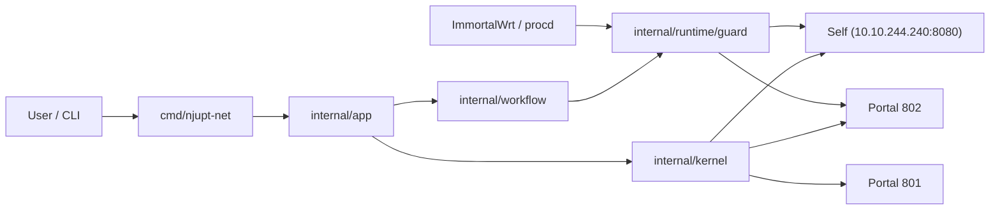

# `njupt-net` 零基逆向复核文档（2026-03）

## 1. 目标与方法

这份文档独立于现有 SSOT，从零重新回答三个问题：

1. `njupt-net` 当前命令树对应的业务页面和业务接口到底有哪些。
2. 这些页面和接口的请求方式、参数、成功条件、失败条件分别是什么。
3. 哪些语义已经可以视为 `confirmed`，哪些只能维持 `guarded` 或 `blocked`。

本轮复核的证据来源只使用三类：

- Chrome DevTools 页面层证据：标题、表单、DOM、稳定文本、跳转链
- Chrome DevTools 网络层证据：URL、方法、参数、响应形状、重定向
- 当前代码实现与真实 CLI 行为的交叉验证

证据等级固定为：

- `confirmed`：有稳定现场证据，可作为正式实现依据
- `guarded`：观察存在，但成功语义不够稳定，或受环境影响较大
- `blocked`：接口存在，但当前不应声称具备稳定成功语义

## 2. 系统边界

现场审计的默认目标是 `njupt-net` 当前命令树范围内的**业务面**，不把普通 CSS/JS 静态资源本身当作协议对象，除非它们携带参数模板或成功判定信号。

## 3. 功能面与协议面总览

当前 CLI 有 8 个功能域、32 个叶子命令：

- `self`：4
- `dashboard`：6
- `service`：6
- `setting`：2
- `bill`：3
- `portal`：4
- `raw`：2
- `guard`：5

本轮复核覆盖的业务页面 / 业务接口可归为 8 组：

1. Self 未登录公共页
2. Self 登录 / 注销
3. Self 受保护顶层页面
4. Dashboard 数据与写接口
5. Service 数据与写接口
6. Setting 数据与写接口
7. Bill 页面与 JSON 列表接口
8. Portal 802 / 801

## 4. Self 未登录公共页

### 4.1 已确认页面

| 页面 | 现场行为 | 证据等级 |
| --- | --- | --- |
| `GET /Self/` | 未登录上下文会重定向到 `GET /Self/login/?302=LI` | `confirmed` |
| `GET /Self/login/?302=LI` | 登录页，包含账号/密码输入框、帮助链接、`randomCode` 请求 | `confirmed` |
| `GET /Self/unlogin/help` | 帮助目录页；当前只有“暂无使用帮助信息”，并会链接到 `helpinfo/0` | `confirmed` |
| `GET /Self/unlogin/helpinfo/0` | 当前只返回“暂无使用帮助信息” | `confirmed` |
| `GET /Self/unlogin/agreement` | 返回完整服务协议静态文本页 | `confirmed` |

### 4.2 页面层证据摘要

- `/Self/` 在无会话上下文下直接落到 `/Self/login/?302=LI`
- 登录页包含：
  - 账号输入框
  - 密码输入框
  - 登录按钮
  - 帮助链接
- `/Self/unlogin/help` 当前没有结构化 FAQ 列表，只有一条占位链接
- `/Self/unlogin/agreement` 是完整的协议文本页，可作为公共静态内容

### 4.3 网络层证据摘要

- `/Self/login/?302=LI` 加载时会拉取 `/Self/login/randomCode`
- `/Self/unlogin/help` 会继续触发 `GET /Self/unlogin/helpinfo/0`

## 5. Self 登录与注销主链

## 5.1 登录链

### 页面 / 请求顺序

1. `GET /Self/login/?302=LI`
2. `GET /Self/login/randomCode`
3. `POST /Self/login/verify`
4. `302 -> GET /Self/dashboard`
5. Dashboard 页再加载：
   - `GET /Self/dashboard/refreshaccount`
   - `GET /Self/dashboard/refreshMauthType`
   - `GET /Self/dashboard/getLoginHistory`
   - `GET /Self/dashboard/getOnlineList`

### 稳定成功条件

- `verify` 成功后进入受保护页面 `/Self/dashboard`
- Dashboard 上的 4 个 XHR 均能正常返回

### 结论

- `self login`：`confirmed`
- `self status`：`confirmed`
- `self doctor`：`confirmed`

## 5.2 注销

### 现场行为

- 路径：`GET|POST /Self/login/logout`
- 真实行为表现为重定向离开受保护页，随后会话失效

### 结论

- `self logout`：`confirmed`

## 6. Self 受保护顶层页面

### 已确认页面

| 页面 | 页面功能 | 证据等级 |
| --- | --- | --- |
| `GET /Self/dashboard` | 首页、在线信息、登录历史、mauth 入口 | `confirmed` |
| `GET /Self/service` | 消费保护、设备管理、运营商绑定入口 | `confirmed` |
| `GET /Self/setting` | 设置入口页 | `confirmed` |
| `GET /Self/setting/userSecurity` | 设置导航页，入口指向 `personList` | `confirmed` |
| `GET /Self/bill` | 账单入口页，链接到三类账单明细 | `confirmed` |

## 7. Dashboard 页面与接口

### 7.1 只读接口

| 接口 | 现场观察 | 证据等级 |
| --- | --- | --- |
| `GET /Self/dashboard/getOnlineList` | 返回当前在线会话列表 | `confirmed` |
| `GET /Self/dashboard/getLoginHistory` | 返回二维历史登录记录 | `confirmed` |
| `GET /Self/dashboard/refreshaccount` | 返回账户摘要片段，当前作为 raw probe 暴露 | `confirmed` |
| `GET /Self/dashboard/refreshMauthType` | 返回 mauth 当前状态片段 | `confirmed` |

### 7.2 写接口

| 接口 | 页面 / 网络观察 | 证据等级 |
| --- | --- | --- |
| `GET /Self/dashboard/oprateMauthAction` | 真实切换后 UI 从“默认”变为“关闭”，前后状态可读回验证 | `confirmed` |
| `GET /Self/dashboard/tooffline?sessionid=...` | 会话可被踢下线，但目标会话消失后可能马上出现新的 follow-up session | `guarded` |

### 7.3 `dashboard offline` 的最终语义

`tooffline` 不是“请求成功就等于稳定离线成功”的接口。现场行为更接近：

1. 目标 `sessionId` 存在时才能发请求
2. 发请求后需要 bounded readback
3. 若目标会话消失，但在线列表中很快出现新的会话，说明“目标会话被踢下线，后续已自动重连”

因此它应维持：

- `dashboard offline`：`guarded`

## 8. Service 页面与接口

## 8.1 页面与入口

| 页面 | 现场观察 | 证据等级 |
| --- | --- | --- |
| `GET /Self/service` | 三个入口：`consumeProtect`、`myMac`、`operatorId` | `confirmed` |
| `GET /Self/service/operatorId` | 页面内存在绑定表单，action 为 `/Self/service/bind-operator` | `confirmed` |
| `GET /Self/service/consumeProtect` | 页面内存在额度表单，action 为 `/Self/service/changeConsumeProtect` | `confirmed` |
| `GET /Self/service/myMac` | 表格页，随后发起 `getMacList` XHR | `confirmed` |

## 8.2 `operatorId` / `bind-operator`

### 表单字段

`operatorId` 页内可确认以下字段：

- `csrftoken`
- `FLDEXTRA1`：电信账号
- `FLDEXTRA2`：电信密码
- `FLDEXTRA3`：移动账号
- `FLDEXTRA4`：移动密码

### 写路径

- `POST /Self/service/bind-operator`
- 真实写路径必须依赖：
  - 预读表单
  - 提交
  - 读回 `operatorId`
  - 必要时 restore

### 结论

- `service binding get`：`confirmed`
- `service binding set`：`confirmed`
- 但业务失败原因应优先于泛化 `readback mismatch`

## 8.3 `consumeProtect` / `changeConsumeProtect`

### 表单字段

`consumeProtect` 页内可确认：

- `csrftoken`
- `consumeLimit`
- 页面文案明确 `999999` 表示“不限制”

### 写路径

- `POST /Self/service/changeConsumeProtect`
- 成功/失败仍需依赖读回

### 结论

- `service consume get`：`confirmed`
- `service consume set`：`confirmed`

## 8.4 `myMac` / `getMacList`

### 页面与接口

- `GET /Self/service/myMac`
- `GET /Self/service/getMacList?pageSize=10&pageNumber=1&sortName=2&sortOrder=DESC...`

### 结论

- `service mac list`：`confirmed`

## 8.5 `service migrate`

该命令不引入新的协议面，本质是：

1. 源账号 `bind-operator clear-all`
2. 目标账号 `bind-operator` 绑定目标字段

因此它是组合 use case，不是额外业务接口。

## 9. Setting 页面与接口

## 9.1 页面

| 页面 | 现场观察 | 证据等级 |
| --- | --- | --- |
| `GET /Self/setting` | 设置入口页 | `confirmed` |
| `GET /Self/setting/userSecurity` | 只提供到 `personList` 的入口 | `confirmed` |
| `GET /Self/setting/personList` | 表单 action 为 `/Self/setting/updateUserSecurity`，页面包含 `csrftoken` | `guarded` |

### 敏感观察

`personList` 页不仅包含普通表单字段，还能在页面脚本里看到敏感的 `window.user.userPassword` 一类信息。这带来一个明确结论：

- 标准 `--output json` 不应直接暴露该页的原始 HTML
- 需要原始页面时，只能通过 `raw` 级能力或受控调试路径观察

## 9.2 写接口 `updateUserSecurity`

### 可确认事实

- `POST /Self/setting/updateUserSecurity` 路径存在
- 页面存在 `csrftoken`
- 页面允许提交

### 仍无法确认的点

- 在真实环境里缺少稳定、可重复的成功判定信号
- 页面返回/跳转不能稳定证明“修改成功”

### 结论

- `setting person get`：`guarded`
- `setting person update`：`blocked`

## 10. Bill 页面与接口

## 10.1 页面层

| 页面 | 现场观察 | 证据等级 |
| --- | --- | --- |
| `GET /Self/bill` | 账单入口页，链接到 `userOnlineLog`、`monthPay`、`operatorLog` | `confirmed` |
| `GET /Self/bill/userOnlineLog` | 上网记录页，带日期范围控件和汇总区 | `confirmed` |
| `GET /Self/bill/monthPay` | 历史账单页，带年份下拉框 | `confirmed` |
| `GET /Self/bill/operatorLog` | 业务办理记录页，带日期范围控件 | `confirmed` |

## 10.2 JSON 列表接口

| 接口 | 现场观察 | 证据等级 |
| --- | --- | --- |
| `GET /Self/bill/getUserOnlineLog` | 与上网记录页绑定，支持日期范围与分页排序 | `confirmed` |
| `GET /Self/bill/getMonthPay` | 与历史账单页绑定，支持年份过滤 | `confirmed` |
| `GET /Self/bill/getOperatorLog` | 与业务办理记录页绑定，支持日期范围与分页排序 | `confirmed` |

### 结论

- `bill online-log`：`confirmed`
- `bill month-pay`：`confirmed`
- `bill operator-log`：`confirmed`

## 11. Portal 802

### 11.1 登录

- 路径：`/eportal/portal/login`
- 常见参数：
  - `callback=dr1003`
  - `login_method=1`
  - `user_account=,0,<account>`
  - `user_password=<password>`
  - `wlan_user_ip=<ip>`

### 11.2 已确认返回

| 返回 | 结论 | 证据等级 |
| --- | --- | --- |
| `{"result":1,"msg":"Portal认证成功！" ...}` | 登录成功 | `confirmed` |
| `{"result":0,"msg":"AC999","ret_code":2}` | 已在线 / 重复登录 / 非致命已在线状态 | `confirmed` |
| `{"result":0,"msg":"未绑定运营商账号,请正确绑定运营商账号再试！","ret_code":1}` | 业务失败，需要先修绑定 | `confirmed` |

### 11.3 注销

- 路径：`/eportal/portal/logout`
- 现场可见：
  - `dr1003({"result":1,"msg":"Radius注销成功！"})`

### 11.4 结论

- `portal login`：`confirmed`
  - 其中 `AC999` 应视为 guarded success / already-online，而不是未知错误
- `portal logout`：`confirmed`

## 12. Portal 801

## 12.1 登录

- 路径：`/eportal/?c=ACSetting&a=Login`
- 现场观察到的稳定返回是通用 EPortal shell：
  - 标题 `EPortal`
  - 通用账号密码登录表单
  - `getSiteInfo` 等壳层请求

### 结论

- 接口存在
- 但缺少稳定机器可判定成功信号
- `portal login-801` 必须维持 `guarded`

## 12.2 注销

- 路径：`/eportal/?c=ACSetting&a=Logout`
- 现场稳定文本：
  - `Logout succeed.`

### 结论

- `portal logout-801`：`confirmed`

## 13. Raw 与 Guard 的协议定位

## 13.1 Raw

`raw get` / `raw post` 不引入新的业务接口；它们是对 Self 侧 HTTP 面的观察和调试入口。

## 13.2 Guard

`guard run/start/stop/status/once` 也不引入新的业务页面。它们组合使用：

- Self 登录状态
- Dashboard 绑定/会话视图
- Portal 802 主恢复链

因此 `guard` 属于运行时策略层，而不是额外协议面。

## 14. 安全边界

这轮现场复核再次确认了一条必须写死的边界：

- 标准 `--output json` 是正式机器接口
- 标准机器接口**不应暴露** `personList` 之类页面中的敏感原始 HTML
- 需要看原始页面时，应明确走 `raw` 能力或受控调试路径

## 15. 从零复核后的总裁决

## 15.1 是否“所有业务页面和接口都已逆向”

**是，但要精确定义。**

在当前命令树覆盖的业务范围内，所有页面和接口都已经被映射到以下三类中的一种：

- `confirmed`
- `guarded`
- `blocked`

因此，如果“已逆向”的定义是“已知页面、接口、参数、返回形状及证据等级”，答案是：

- **是，当前命令树范围内已经全部逆向完成。**

如果“已逆向”的定义是“全部都达到 confirmed 成功语义”，答案是：

- **否。**

仍需保留非 `confirmed` 语义的项有：

- `dashboard offline`：`guarded`
- `setting person get`：`guarded`
- `setting person update`：`blocked`
- `portal login-801`：`guarded`

## 15.2 是否“所有逆向出来的功能都已实现”

从命令树角度看，答案是：

- **是，32 个叶子命令全部存在并映射到了已知协议面。**

但从“全部都可作为 confirmed 正式能力”角度看，答案是：

- **否。**

原因不是缺实现，而是现场证据本身要求它们继续维持 `guarded` / `blocked`。

## 15.3 最终一句话结论

`njupt-net` 当前命令树范围内的业务页面和业务接口已经完成零基逆向覆盖，所有 32 个叶子命令都已有对应实现；但并不是所有能力都拥有 `confirmed` 成功语义，`dashboard offline`、`setting person get/update`、`portal login-801` 仍必须按 `guarded` / `blocked` 对待。
